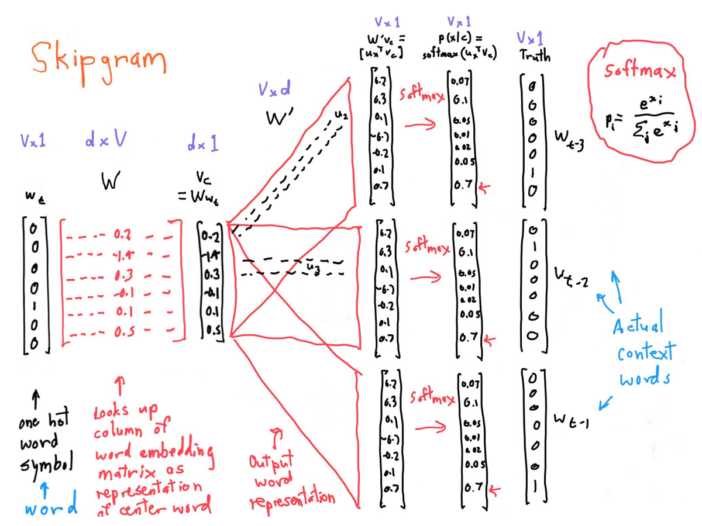

ⓒ JMC 2017

Source : https://www.youtube.com/playlist?list=PL3FW7Lu3i5Jsnh1rnUwq_TcylNr7EkRe6

---

## L02 Word Vector Representation

### 01 단어의 의미 재현하기

**단어간의 유사성을 어떻게 측정할 수 있을까**:

단어의 의미는 함께 쓰이는 단어를 보면 알 수 있다.

1. government debt problems turning into **banking** crises as happend in
2. saying that Europe needs unified **banking** regulation to replace the hodgepodge

단어 banking의 의미를 알기 위해서 banking이 쓰인 수천 개 문장을 찾고, 각 문장을 살펴본다.
가령, 위 2가지 문장을 보면 debt problems, governments, regulation, Europe, saying unified 등이 등장한다.
banking과 함께 쓰이는 모든 단어들의 개수를 카운팅한다.
함께 쓰이는 단어들은 banking의 의미를 represent하는 context words로 사용할 수 있다.
이러한 방식으로 단어의 의미를 찾는 방법을 distributional similarity라고 한다.

**단어의 의미를 벡터로 정의할 수 있다**:

각 단어가 함께 사용되는 단어들로 의미를 재현할 수 있다는 생각에서 더 나아가 본다.
각 단어는 dense vector로 표현할 수 있다.
이때, 단어 A의 dense vector는 단어 A가 사용되는 문장에 등장하는 다른 단어를 예측할 수 있도록 만들어야 한다.

단어 A와 함께 쓰이는 다른 단어들을 "context words"라고 하자.
"context words" 또한 함께 쓰이는 단어들이 있다.
이때 유사도를 측정하기 위해 단어 A를 나타내는 벡터와 "other words"를 나타내는 벡터의 내적을 구한다.
이때, 예측이 잘 되도록 두 벡터의 값을 조절한다.
재귀적인 연산을 포함하는 알고리즘을 통해 단어 A가 해당 context words를 잘 예측하고, context words가 단어 A를 잘 예측하도록 만든다.

**distributional vs. distributed representation**:

distributional similarity와 distributed representation은 혼동되는 개념이다.
distributed representation은 단어의 의미를 represent하는 dense vector에서 사용한다.
distributed representation은 distributional similarity는 개념을 사용해서 만들어진다.
distributional similarity는 단어의 의미에 대한 이론으로써 단어가 등장하는 context를 통해 단어의 의미를 파악하는 이론이다.

distributional은 denotational과 대조되는 개념이다.
단어의 의미에 대해 denotational은, 예를 들어, "안경"이라는 단어는 수많은 "안경"을 통해 의미가 정해진다.
(The deonotational idea of word meaning is the meaning of "glasses" is the set of pairs of glasses that are around the place. That's different from distributional meaning.)
즉, denotational은 단어의 개념적인 내용(conceptual content)을 전달한다.

> **Note**: Denotational Meaning 예시 : notorious - widely known, celebrated - widely known.

distributed는 one-hot word vector와 대조되는 개념이다.
one-hot word vector는 특정 샘플만 지역적(locally)으로 살펴본 representation이다.
가령, "안경"이라는 단어는 one-hot vector에서 값이 1인 index에 저장되어 있다고 말한다.
반면에 distributed representation에서는 아주 큰 벡터 공간에서 어떤 단어의 의미를 smearing(?)한다. (we're smearing the meaning of something over a large vector space.)

### 02 Word2Vec

Suggested Readings : [word2vec-skip-gram.md](word2vec-skip-gram.md)

**word2vec의 핵심 아이디어**:

word2vec의 원리는 특정 단어와 그 단어와 같이 쓰이는 단어의 관계를 예측하는 것이다.
word2vec의 모델은 input word가 주어졌을 때 어떤 단어가 등장할 probability distribution을 구한다.

+ $p(context | w_t)$
  + $w_t$ : center word (=input word)

이때 모델은 $p(context | w_t)$을 maximize하도록 word vector를 학습한다.

**Details of word2vec**:

training documents에 단어가 $t \in \{1, \cdots, T\}$개 있다고 할 때, 모델은 각 단어의 앞뒤로 $m$개의 단어를 예측한다.
이때 $m$을 window of "radius"라고 부르며, center word의 앞뒤로 $m$개를 살펴보므로 전체 window size는 $2m$이 된다.

모델의 목적 함수(=loss function)인 $J$는 input word가 주어졌을 때 context word가 등장할 probability distribution을 maximze하는 것이다.

$$J^{\prime} (\theta) = \Pi_{t=1}^{T}\Pi_{-m \leq j \leq m, \ j \neq 0}p(w_{t+j} | w_t ; \theta)$$

단, 계산의 효율을 고려해서 곱셈 연산은 log의 덧셈으로 바꿔주고 -log를 최소화하도록 목적함수 $J$를 negative log likelihood로 바꿔준다.

$$J(\theta) = -\frac{1}{T} \Sigma_{t=1}^{T}\Sigma_{-m \leq j \leq m, \ j \neq 0}\log p(w_{t+j} | w_t ; \theta)$$

모델은 위 목적 함수의 값이 최소화되는 $\theta$를 찾도록 학습된다.
여기서 $\theta$는 단어를 벡터로 표현한 word vector를 뜻한다.

**Details of loss function**:

loss function에 probability distribution이 포함되어 있다는 것은(=loss function이 negative log likelihood일 때) cross-entropy loss를 쓴다는 의미이다.

negative log likelihood를 최소화하는 word vector를 찾는 방법이 무엇인지 구체적으로 알아보자.

$$P(o | c) = \frac{\exp(u_o^{T}v_{c})}{\Sigma_{w=1}^{V} \exp(u_o^{T}v_{c})}$$

+ $o$ : output word(=context word)의 index
+ $c$ : center word의 index
+ $u_o$ : output word(=context word)의 vector
+ $v_c$ : center word의 vector

$u_o$와 $v_c$를 내적하는 이유는 두 벡터의 유사도를 측정하는 loose한 기준으로 볼 수 있기 때문이다.
두 벡터의 content가 서로 비슷할수록 내적값은 더 커진다.

내적한 값에 softmax function을 취하는 이유는 숫자를 확률(probability distribution)값으로 바꾸기 위해서이다.
두 벡터의 내적값인 실수(real numbers)를 exponetiate하면 항상 양수의 값이 된다.
특정 범주를 구성하는 요소의 값이 모두 양수라는 것은 probability distribution을 갖기 위한 기초 조건이다.
개별 내적값을 양수로 만들고, 그 값을 전체 내적값의 합에 대한 비율로 나타내면 확률값이 완성된다.
softmax function을 통해 실수를 확률값으로 normalize한 것이다.

주의해야 할 점이 있다.
개별 단어는 두 가지 벡터를 가진다.
하나는 그 단어가 center word일 때의 벡터이고, 나머지 하나는 그 단어가 context word일 때의 벡터이다.
이렇게 분리시키는 이유는 수학적으로 훨씬 쉽기 뿐만 아니라, optimization을 할 때 두 벡터가 함께 묶여 있지 않고 분리되기 때문이다.
하나의 단어가 두 가지 벡터를 가지도록 하는 게 경험적으로도 더 잘 작동한다고 한다.

**Q. softmax function을 사용하면 기존 값의 scale이 망가져버리지 않나요?**
맞다.
Softmax 함수의 이름이 Softmax인 이유는 Max 함수와 비슷하기 때문이다.
실수값을 exponetiate하면 큰 값은 훨씬 더 커지기 때문에 큰 값들의 영향력이 훨씬 더 커지게 된다.
즉, 완전하진 않지만(not fully) max function의 방향으로 불어나게(blow out) 된다.
이때, 완전히 max function의 방향은 아니지만 상당히 유사한 방향성을 갖고 있으므로 softmax라고 부른다.
아마 이렇게 되면 좋지 않을 거라고 생각할 수도 있다.
다만, softmax function은 logstic regression을 포함해서 매우 흔하게 사용되며, 수학적으로 가장 표준적인 방법이다.
단, softmax function은 경험적으로 좋은 방법이지만 다른 방법을 사용하는 사람들도 있다.
그러나 이번 강의에서는 이에 대해 다루지 않을 것이다.

**Q. 본 모델에서 context word의 position 또는 center word와의 distance가 고려되는 건가요?**
전혀 고려되지 않는다.
단지, window size 안에 그 단어가 있다는 일치 여부(identity)만 고려한다.
물론, identity만 고려하는 게 가장 좋은 방법이라고 할 수는 없다.
position과 distance을 고려하는 모델들도 존재한다.
특히 단어의 의미보다는 문법을 다루는 목적에서는 position과 distance를 고려하는 것이 매우 도움이 된다.
단, 단어의 의미에 집중한다면, 오히려 position을 고려하지 않는 것이 도움을 주면 주지 해치지는 않는다.

**Skipgram model**

`@@@resume` https://youtu.be/ERibwqs9p38?t=38m51s

---

---
